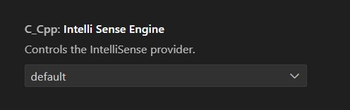
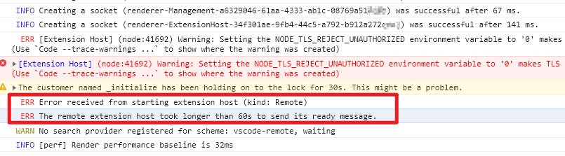

## c/c++ extension can't use

当使用vscode进行ssh远程连接遇到c/c++扩展不可用时，排除顺序  

1.判断c/c++插件只能感知引擎是否打开  

  

2.删除** Visual Studio Code 简体中文语言包**，因为中文插件包在远端服务器启动很慢导致
`Error received from starting extension host (kind: Remote)`进而导致连接超时  

